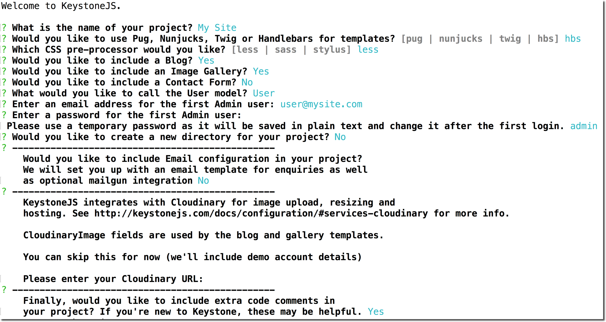

# keystone-cosmosdb-how-to
How to run keystone.js with Azure Cosmos DB + MongoDB API
---
title: 'Azure Cosmos DB: Deploy Keystone.js with the MongoDB API | Microsoft Docs'
description: Presents how to configure Keystone.js to use the Azure Cosmos DB MongoDB API, and deploy to Azure Web Apps.
services: cosmos-db, azure-web-apps
documentationcenter: ''
author: davimak
manager: sarasp
editor: ''

ms.assetid: 
ms.service: cosmos-db
ms.custom: quick start connect
ms.workload: 
ms.tgt_pltfrm: na
ms.devlang: dotnet
ms.topic: hero-article
ms.date: 08/08/2017
ms.author: davimak

---
# Azure Cosmos DB: Deploy Keystone.js with Cosmos DB and the MongoDB API

Azure Cosmos DB is Microsoft’s globally distributed multi-model database service. You can quickly create and query document, key/value, and graph databases, all of which benefit from the global distribution and horizontal scale capabilities at the core of Azure Cosmos DB. 

This quick start demonstrates how to build and run a Keystone.js CMS locally, using the Cosmos DB emulator. You'll then create an Azure Cosmos DB account, document database, and collection using the Azure portal, and configure Keystone.js to use your new database. Finally, you'll deploy your new Keystone.js CMS to an Azure Web App.

## Prerequisites

- Node.js + npm

Keystone.js requires Node.js, as well as npm. You'll need to make sure these are installed.

- Git

This quickstart uses git integration when publishing to Azure. If you'll only be testing locally, you won't need git.

- Download the [Azure Cosmos DB Emulator](https://docs.microsoft.com/en-us/azure/cosmos-db/local-emulator). The emulator is currently only supported on Windows. This quickstart will also show how to use Keystone.js with a production Cosmos DB database in Azure, which can be done from Windows, Mac, or Linux.

- If you don’t already have Visual Studio Code installed, you can install [VS Code](https://code.visualstudio.com/Download) for your platform (Windows, Mac, Linux).

<a id="create-keystone"></a>
## Create a Keystone.js instance


 ### Install keystone.js generator

 When creating a Keystone.js CMS, you get to choose which components will be included (blog, gallery, contact form), what templating style to use (Handlebars, etc.), and a photo-hosting account. A separate project, `generator-keystone`, contains the instructions for creating your customized Keystone CMS.

 To install `generator-keystone`, execute the following `npm` command:

```
npm install -g generator-keystone
```

### Install yeoman

`Yeoman` is the tool which executes the instructions found in `generator-keystone`. To install `yeoman`, execute the following `npm` command:

```
 npm install -g yo
 ```

### Generate your Keystone.js CMS

Now comes the fun part: creating your CMS. Navigate to a directory where you'd like to place your Keystone.js CMS deployment, and run the following `yeoman` command:

```
yo keystone
```
This will walk you through a few questions about which components you'd like to install, and which template style you'd prefer. You'll also be able to specify an admin username.

For this example, the blog and gallery will be created, using Handlebars and the default photo-hosting settings:



As soon as all questions are answered, `yeoman`, using the instructions from `generator-keystone`, creates your new Keystone.js CMS. upon successful generation, you'll see instructions for running your new CMS:


## Fixing the gallery

If you choose to include a gallery, you'll need to fix a small bug related to gallery sorting. Keystone specifies an incorrect property to sort the gallery by.

With VS Code (or any other editor), open `routes/views/gallery.js` and change the following:

```js
view.query('galleries', keystone.list('Gallery').model.find().sort('sortOrder'));
```

To:
```js
view.query('galleries', keystone.list('Gallery').model.find().sort('-publishedDate'));
```

### Pointing Keystone.js to Cosmos DB emulator

The Cosmos DB emulator listens on port 10250 and 10255, and has a fixed username and password. The connection string looks like this:

```
mongodb://localhost:C2y6yDjf5/R+ob0N8A7Cgv30VRDJIWEHLM+4QDU5DE2nQ9nDuVTqobD4b8mGGyPMbIZnqyMsEcaGQy67XIw/Jw==@localhost:10255/admin?ssl=true&3t.sslSelfSignedCerts=true
```

In the `.env` file, located in your newly-created Keystone.js directory, add the connection string, by adding the `MONGO_URI` parameter:

```
COOKIE_SECRET=...
CLOUDINARY_URL=...
MONGO_URI=mongodb://localhost:C2y6yDjf5/R+ob0N8A7Cgv30VRDJIWEHLM+4QDU5DE2nQ9nDuVTqobD4b8mGGyPMbIZnqyMsEcaGQy67XIw/Jw==@localhost:10255/admin?ssl=true&3t.sslSelfSignedCerts=true
```
 
 ### Test Keystone.js locally

 Navigate into your newly-created Keystone.js directory, and execute the following command:

 ```
 node keystone
 ```

 At this point, you should be able to browse to `https://localhost:3000` and navigate your new Keystone.js CMS.

 Note: By default, keystone.js does not add a publish date to blog posts. Be sure to add a date for each blog post. Otherwise, when using Cosmos DB (whether the emulator or cloud-based database service), you won't see any posts listed that don't have a publish date.

 

 ## Deploy your CMS to Azure
 
 To deploy your new Keystone CMS to Azure, you'll create an Azure Web App, along with git integration.

 Note: To simplify viewing all of your Azure resources in one place, choose the same Resource Group name for your Cosmos DB database and your Web App.

### Create a database account

[!INCLUDE [cosmos-db-create-dbaccount](../../includes/cosmos-db-create-dbaccount-mongodb.md)]


### Create an Azure Web App with Git integration
To deploy your Keystone CMS, you can create a new web app in Azure and enable continuous deployment with git. Please follow [this tutorial](https://docs.microsoft.com/en-us/azure/app-service/app-service-continuous-deployment) to set up continuous deployment with Github in Azure. For this quickstart, choose `Local Git Repository`:


### Configure git within your local Keystone folder

From the Azure portal, navigate to your web app's Overview and copy the git url. Then, run the following command from your keystone.js cms directory:

```
git init
git remote add azure https://<your-git-url>.git
```

### Configure keystone to use Cosmos DB databse in Azure
From the portal, navigate to your Cosmos DB database. Navigate to the Connection String settings, and copy your connection string.

Now navigate to the App Settings for your newly-created Web App. Add a `MONGO_URI` setting, with the connection string you copied from your Cosmos DB database.

Also, add your `CLOUDINARY_URL` and `COOKIE_SECRET` settings, which you'll copy from your keystone.js CMS `.env` file:


### Deploy code to Azure

Now that your local folder is configured correctly, add the Keystone content to git, and push it to Azure:

```
git add .
git commit -m "Add keystone.js cms"
git push azure master
```

At this point, your keystone.js cms code will be pushed to your Web App. You can monitor its status on the Deployment Options tab:


When the deployment is complete, open a browser to view your web app, at `https://<yourwebapp>.azurewebsites.net`. You should see the keystone.js welcome page.

At this point, your keystone.js CMS is up and running, storing its content in Cosmos DB!

## Clean up resources

If you're not going to continue to use this app, delete all resources created by this quickstart in the Azure portal with the following steps:

 1. From the left-hand menu in the Azure portal, click **Resource groups** and then click the name of the resource group you created. 
 2. On your resource group page, click **Delete**, type the name of the resource to delete in the text box, and then click **Delete**.


